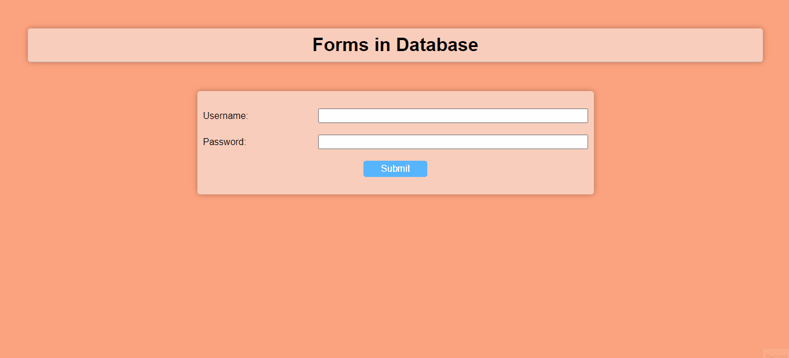

# Contact_form

<h3>This site was made by using HTML, CSS and JavaScript.</h3>

<h3>Additionally I used <a href="https://cdnjs.com/libraries/font-awesome"><b>Font Awesome</b> </a> (for icons) </h3>

<h3>The aim of this JS application is how we can react to the user on the UI side with JS</h3>

<h3> and how we can communicate with an API using JS with the help of mongodb.</h3>

<h3>Here you can see /add-form and /get-forms.</h3>

<h3>It is a good example project.</h3>

<h3>Screen preview:</h3>

Enjoy Coding ❤

